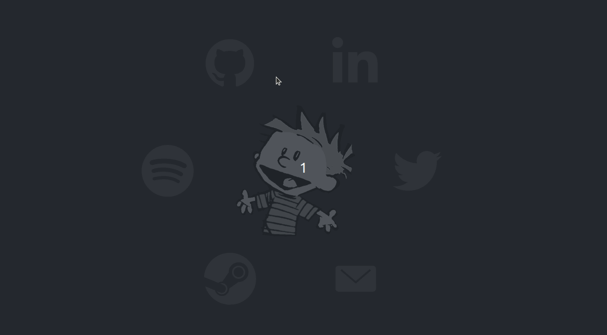
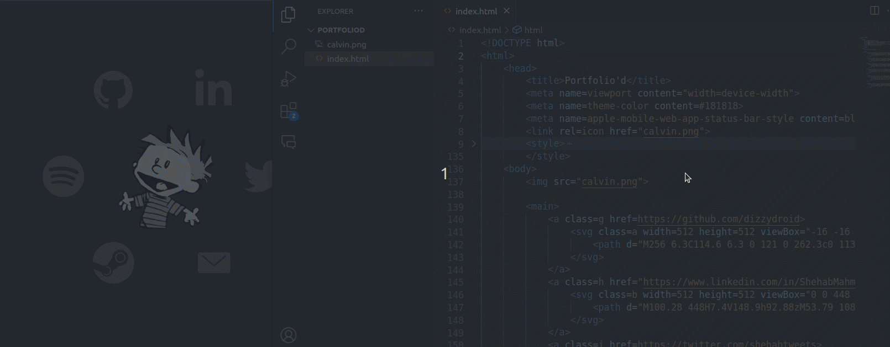

# Portfolio'd

 

## Your portfolio, simply made!

<pre align = "center"> <b> 
<a href="https://dizzydroid.github.io/portfoliod">View Example</a> </b>
</pre>

### A simple webpage offering limitless possibilities for your unique portfolio!

 
   

 
In its own way, this simple webpage acts as a captivating portfolio that <i>you</i> can finetune to your liking!

#### With basic HTML knowledge you can edit pretty much anything!

 
   

 
<b>You can edit the colors, picture, svg paths.. anything!</b>

 
 

<ins>**Tip:**</ins> To replace the icons you need to use proper svg paths, you can find them at: https://icons.getbootstrap.com/icons/ 
______________________________________
### Report any <a href = "https://github.com/dizzydroid/portfoliod/issues"><b>issues</b></a> you encounter!
___________________________________________________________

 This web-app is part of the <a href = "https://dizzydroid.github.io/blog.html">DizzyBlog</a> © dizzydroid. All rights reserved 

